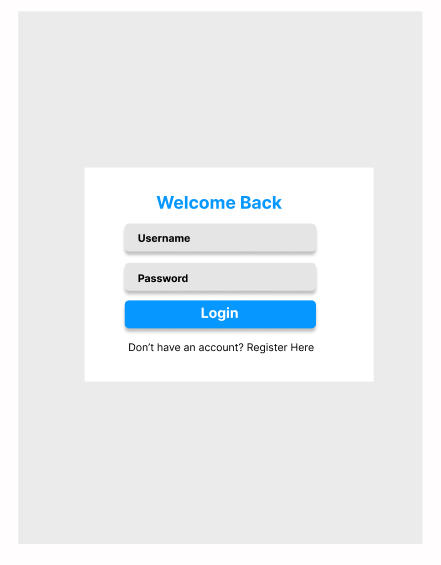
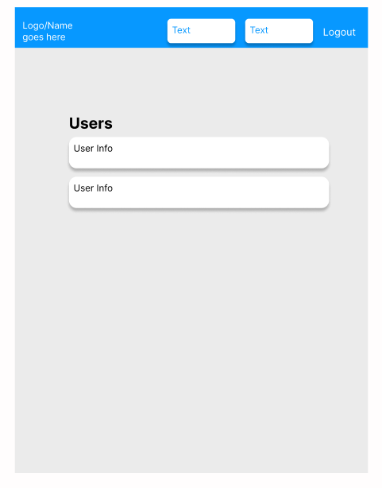

# LMS - Learning Management System

A full-stack Learning Management System where students can browse and enrol in courses, teachers can create and manage courses, and admins can manage the platform. The backend is built with Django and Django REST Framework, and the frontend is built with React.

## Purpose

This application allows educational institutions to manage their courses and students online. Users register with a role and are given a dashboard based on that role. Students can browse courses and enrol in them, teachers can create and manage their own courses, and admins have full control over the platform including being able to manage users.

## Features

- **User Authentication** - Users can register and log in securely. When a user logs in they receive a JWT token which is used to authenticate all future requests.
- **Role Based Access** - There are three roles: student, teacher and admin. Each role has a different dashboard and different levels of access.
- **Course Management** - Teachers and admins can create courses. Students can only view them.
- **Student Enrolment** - Students can enrol in courses and view the ones they are enrolled in.
- **Admin User Management** - Admins can view all users on the platform.
- **Protected Routes** - If a user tries to access a page without being logged in they are redirected to the login page.

## Technologies Used

- **Django** - The Python web framework used to build the backend.
- **Django REST Framework** - Used to build the API that the React frontend talks to.
- **Simple JWT** - Handles the JWT token authentication when users log in.
- **django-cors-headers** - Allows the React frontend on port 3000 to communicate with the Django backend on port 8000.
- **SQLite** - The database used to store all the data.
- **React** - Used to build the frontend that the user sees and interacts with.
- **React Router DOM** - Handles the navigation between pages in the React app.
- **Axios** - Used to make HTTP requests from React to the Django API.
- **Git/GitHub** - Used for version control throughout the project.

## How It Works

The application is split into two parts - a Django backend and a React frontend. They communicate with each other through a REST API.

When a user logs in, Django checks their credentials against the database and if they match, it sends back two JWT tokens - an access token and a refresh token. React stores these in localStorage. Every time React needs data from the backend it sends the access token in the request header so Django knows who is making the request.

The backend has two Django apps - courses and users. The courses app handles everything to do with courses and enrolments. The users app handles registration, login and user management.

Each feature on the backend follows the same pattern - a model defines the database table, a serializer converts the data between Python and JSON, a view handles the request logic, and a URL maps the endpoint to the view.

On the frontend, React Router handles navigation between pages. Each page checks for a valid token in localStorage when it loads - if there is no token the user gets redirected to the login page.

## Installation

Follow these steps to run the project locally:

### Backend

1. Clone the repository:

```bash
git clone https://github.com/DanSmith8011/lms-project.git
cd lms-project
```

2. Create and activate a virtual environment:

On Mac:

```bash
python3 -m venv venv
source venv/bin/activate
```

On Windows:

```bash
python -m venv venv
venv\Scripts\activate
```

3. Install the required packages:

```bash
pip install django djangorestframework djangorestframework-simplejwt django-cors-headers
```

4. Navigate to the backend folder and run the migrations:

```bash
cd backend
python manage.py migrate
```

5. Create an admin user:

```bash
python manage.py createsuperuser
```

6. Start the server:

```bash
python manage.py runserver
```

The backend will be running at http://127.0.0.1:8000

### Frontend

1. Open a new terminal and navigate to the frontend folder:

```bash
cd lms-project/frontend
```

2. Install the dependencies:

```bash
npm install
```

3. Start the React app:

```bash
npm start
```

The frontend will be running at http://localhost:3000

## API Endpoints

### Users

- POST /api/users/register/ - Register a new user
- POST /api/users/login/ - Log in and get JWT tokens back
- GET /api/users/all-users/ - Get all users (must be logged in)

### Courses

- GET /api/courses/ - Get all courses (must be logged in)
- POST /api/courses/ - Create a new course (teachers and admins only)
- GET /api/courses/id/ - Get a single course
- PUT /api/courses/id/ - Update a course (teachers and admins only)
- DELETE /api/courses/id/ - Delete a course (teachers and admins only)

### Enrolments

- GET /api/enrolment/ - Get the logged in user's enrolments
- POST /api/enrolment/ - Enrol in a course

## Running the Tests

### Django Tests

```bash
cd backend
python manage.py test
```

### React Tests

```bash
cd frontend
npm test
```

### Code Validation

**HTML Validation (W3C)**
The HTML was validated using the W3C Markup Validation Service. No errors or warnings were found, only informational messages about trailing slashes which are automatically generated by React's build process.


**CSS Validation (Jigsaw)**
The CSS was validated using the W3C CSS Validation Service (Jigsaw).


**Python Linting (Flake8)**
The Python code was checked using Flake8. Minor style warnings were found relating to blank lines and trailing whitespace. No critical errors were found. Migration files were excluded from linting as they are auto-generated by Django.


**JavaScript (ESLint)**
The React application was built successfully with no ESLint errors using npm run build.


## User Roles

**Student** - Can browse courses, enrol in courses and view their enrolled courses.

**Teacher** - Can do everything a student can plus create and manage courses.

**Admin** - Can do everything a teacher can plus manage all users on the platform.

## Wireframes

### Login Page



This is the login page wireframe. It shows the username and password input fields, a login button and a link to the register page for new users.

### Register Page


This is the register page wireframe. It shows the username, email, password and role input fields along with a register button and a link back to the login page.

### Student Dashboard


This is the student dashboard wireframe. It shows the navbar at the top and two buttons - one to view all courses and one to view enrolled courses.

### Teacher Dashboard


This is the teacher dashboard wireframe. It shows the navbar and two buttons - one to view courses and one to create a new course.

### Admin Dashboard


This is the admin dashboard wireframe. It shows the navbar and three buttons - view courses, manage users and create a course.

### Courses List Page


This is the courses list page wireframe. It shows a list of course cards each displaying the course title, description and an enrol button.

### Create Course Page


This is the create course page wireframe. It shows two input fields for the title and description and a create course button.

### Enrolled Courses Page


This is the enrolled courses page wireframe. It shows a list of courses the student has enrolled in along with the date they enrolled.

### Admin Users Page



This is the admin users page wireframe. It shows a list of all users on the platform displaying their username, email and role.

## Deployment

**Live Application:** https://glittering-flan-17ad35.netlify.app

**Backend API:** https://lms-backend-d72v.onrender.com

The frontend is deployed on Netlify and the backend API is deployed on Render.
